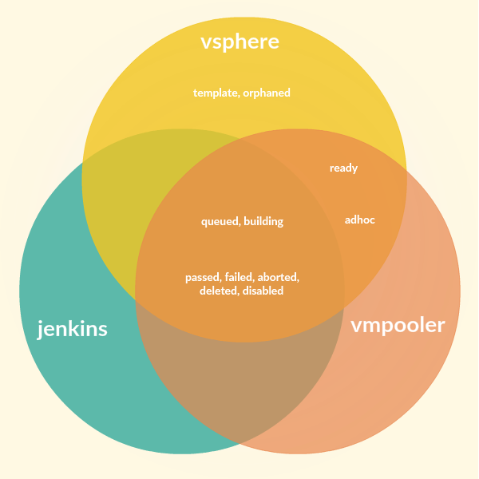

# vmstatus

vmstatus correlates virtual machines in VMware vSphere against vmpooler and Jenkins jobs in order to understand which VMs are doing useful work. It groups virtual machines into one of the following states:



| State | Description |
|--------|-------------|
| `queued` | VM is associated with a queued Jenkins job |
| `building` | VM is associated with a building Jenkins job |
| `ready` | VM is idle in vsphere and is ready to be checked-out |
| `adhoc` | VM is checked out, but is not associated with any Jenkins job |
| `aborted` | VM is checked out and is associated with an aborted Jenkins job |
| `passed` | VM is checked out and is associated with a passing Jenkins job |
| `failed` | VM is checked out and is associated with a failed Jenkins job |
| `disabled` | VM is checked out and is associated with a disabled Jenkins job |
| `deleted` | VM is checked out and is associated with a deleted Jenkins job |
| `orphaned` | VM is running but there is no record in vmpooler |
| `zombie` | VM is not in vsphere, but vmpooler thinks it is |

The `queued` and `building` states mean the VM is in vSphere and is associated with a currently running Jenkins job, so it is doing useful work. All other states are unuseful from a production CI perspective.

## Requirements

Tested on MRI Ruby 2.1 and newer.

Depends on the following gems:

* redis
* rest-client
* concurrent-ruby
* ruby-progressbar
* slop
* colorize
* statsd-ruby >= 1.3.0
* rbvmomi

## Usage

### Global Options

All of the commands support the following options:

| Option | Description |
|--------|-------------|
| `--host` | The vSphere hostname |
| `--user` | Your vSphere username |
| `--password` | Your vSphere password (or specify via `ENV['LDAP_PASSWORD']`) |
| `--datacenter` | The vSphere datacenter |
| `--cluster` | The vSphere cluster |
| `--vmpooler` | A comma-separated list of vmpooler redis hostnames to reconcile VMs against |

### Summary

Provide a summary of VMs in each state:

```
$ bundle exec vmstatus summary --host vcenter --user user@foo.com
Querying vsphere 'vcenter' for VMs in cluster 'cluster1' in datacenter 'dc1'
Processing 1657 VMs, ignoring 243 templates
Time: 00:01:00 ====================================================================================== 100% Progress

Number of VMs associated with running Jenkins jobs
      0 queued
     90 building

Number of VMs associated with completed Jenkins jobs
     78 passed
     42 failed
     35 aborted
      0 disabled
      2 deleted

Number of VMs not associated with any vmpooler
    118 orphaned

Number of VMs not associated with any Jenkins job
    142 adhoc
   1150 ready
      0 unknown

Efficiency 5.4%, 90 out of 1657 VMs are doing useful work
```

### List

List the status of each VM:

```
$ bundle exec vmstatus list --host vcenter --user user@foo.com
Querying vsphere 'vcenter' for VMs in cluster 'cluster1' in datacenter dc1'
Processing 1670 VMs, ignoring 243 templates
Time: 00:06:41 ====================================================================================== 100% Progress

Hostname        Status    Running  Checkout Time                     TTL User                Jenkins Job
afzowkwedv1m39e aborted    on/*    2017-01-24T12:53:06-08:00       7.11h jenkins             enterprise_pe-orchestrator_integration-system_smoke-flanders
bv3qyq0f9bkphb2 adhoc      on/*    2017-01-24T08:05:14-08:00       2.31h kermit
a21vj6t37jxqq4t building   on/*    2017-01-24T17:35:46-08:00      11.82h jenkins             enterprise_pe-acceptance-tests_integration-system_pe_smoke-split_2017.2.x
bwbgwxs4qdss18w failed     on/*    2017-01-24T09:26:39-08:00       3.67h jenkins             enterprise_puppet-code_intn-van-sys_flanders
dpisyffpvy3d9if orphaned   on/*                                    never
bnzks2bgm1sb8gn ready      on/*                                    never
yt42hvi9qvzfs6i ready      on/!                                    never
```

This displays each VM sorted by hostname along with its status, running state, checkout time, vmpooler TTL, user the VM is checked out to, and the Jenkins Job the VM is associated with.

Vmstatus reports on the running state of the VM as reported by vSphere, e.g. "on". The "*" means the VM's hostname is resolvable and we can make a TCP connection to port 22. An "!" means we failed to connect, even though the VM is running according to vSphere. That can be due to transient network errors, DNS failures, the VM failed to respond within a specified timeout, the VM is unresponsive, etc.

#### long

The `-l` or `--long` option will print the complete Jenkins job URL, as opposed to the job name.

#### sort

The `-s` or `--sort` option allows you sort by different fields. For example, to see all VMs associated with a job use `--sort job`.

### Stats

Vmstatus will publish the following stats. Currently only statsd is supported. Stats are published to the `vmstatus` namespace, and are grouped by the name of the `vmpooler` that the VM is associated with:

| Name | Description|
|------|------------|
| `<pooler>.aborted` | Number of running VMs, whose Jenkins jobs were aborted |
| `<pooler>.adhoc`   | Number of running VMs that are checked out, but are not associated with any Jenkins job |
| `<pooler>.building` | Number of running VMs, whose Jenkins jobs are building |
| `<pooler>.deleted` | Number of running VMs, whose Jenkins job was deleted |
| `<pooler>.failed` | Number of running VMs, whose Jenkins jobs failed |
| `<pooler>.disabled` | Number of running VMs, whose Jenkins job are disabled |
| `<pooler>.passed` | Number of running VMs, whose Jenkins jobs completed successfully |
| <pooler>.queued | Number of running VMs, whose Jenkins jobs are queued, e.g. waiting on a mesos executor |
| <pooler>.ready | Number of running VMs, idle in vsphere and ready to be checked-out |
| `<pooler>.zombie` | Number of VMs that the pooler thinks are running, but are not actually |
| `none.orphaned` | Number of VMs running, but there is not record in any vmpooler |

